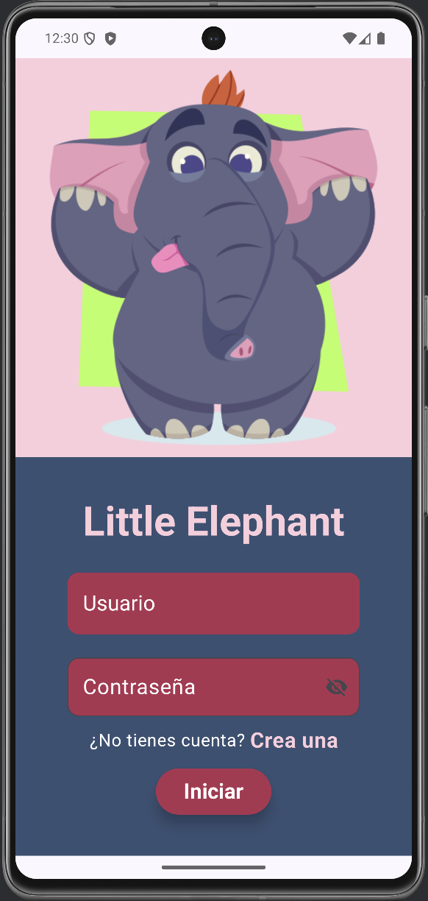
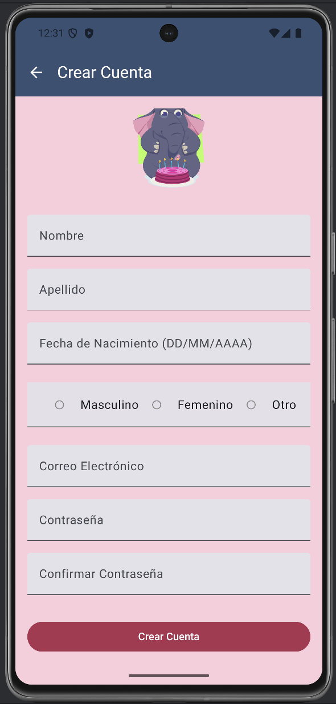
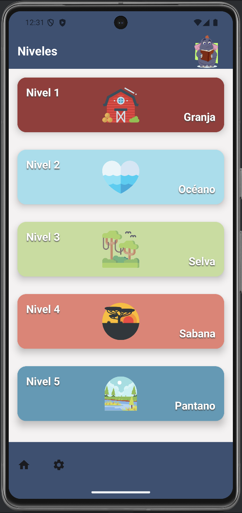

# Little Elephant

**Little Elephant** es una aplicación móvil educativa diseñada para ayudar a los niños de primaria a aprender inglés de manera divertida y efectiva. La aplicación ofrece múltiples niveles de aprendizaje, donde los niños pueden explorar vocabulario de diferentes categorías, como animales, colores, alimentos y más.



## Descripción del Proyecto

El proyecto consiste en el desarrollo de una aplicación móvil llamada **Little Elephant**, diseñada para el aprendizaje del inglés en niños con un enfoque en el vocabulario. La estructura de aprendizaje está inspirada en el modelo de **Duolingo**, donde los usuarios deberán desbloquear niveles progresivamente a medida que avanzan.

Inicialmente, la aplicación será exclusiva para dispositivos **Android**, con una interfaz desarrollada en **Android Studio**. Sin embargo, el **backend** se implementará de forma independiente para facilitar su integración con otras interfaces en el futuro, permitiendo una versión web y garantizando un sistema modular y escalable.

Además, la aplicación estará disponible en **español e inglés** para mejorar la accesibilidad a usuarios con distintos niveles de conocimiento. También se integrará con la API de **Google Sign-In** para gestionar el inicio de sesión en Android. La administración de usuarios y niveles se manejará mediante una base de datos.

## Alcance

- Desarrollo de una interfaz gráfica intuitiva y atractiva.
- Backend modular y escalable.
- Integración con APIs externas para funcionalidades adicionales.
- Implementación de **cinco niveles iniciales**.
- Disponibilidad en **español e inglés**.

## Resumen de Funcionalidades

- Registro e inicio de sesión con **Google Sign-In** o mediante datos manuales.
- Visualización de imágenes con selección de la palabra correcta en inglés.
- Reproducción de sonidos para mejorar la pronunciación.
- Seguimiento del progreso del usuario.
- Interfaz adaptada para niños, con diseño amigable y colores llamativos.
- Escalabilidad para agregar nuevos niveles y funcionalidades.
- Opción para cambiar el idioma de la aplicación.




## Tecnologías a Utilizar

- **Frontend**: Android Studio con **Jetpack Compose**.
- **Backend**: Node.js con **NestJS** y **TypeScript**.
- **Base de Datos**: **MongoDB**.
- **Autenticación**: Integración con **Google Sign-In**.
- **Servicios Externos**: APIs para generación de sonidos.
- **Infraestructura**: Arquitectura escalable y modular para futuras ampliaciones.



## Estado Actual

- **Frontend**: Actualmente, el frontend de la aplicación está completamente desarrollado con **Jetpack Compose**.
- **Backend**: Se está implementando con **Node.js y NestJS**.
- **Base de Datos**: Uso de **MongoDB** para almacenar información de usuarios y progreso.

## Instalación

1. Clona el repositorio:
   ```bash
   git clone https://github.com/usuario/Little-Elephant.git
