# Little Elephant - Frontend

## Descripción

**Little Elephant** es una aplicación educativa Android diseñada para el aprendizaje de vocabulario en inglés para niños mayores de 5 años. A través de la exploración de ecosistemas temáticos (como Granja, Océano o Jungla), los usuarios interactúan con imágenes, sonidos y preguntas dinámicas. La app se desarrolla con **Jetpack Compose** y está conectada a un backend REST desacoplado y escalable.

## Funcionalidades del Frontend

- Registro y login con validaciones integradas.
- Exploración y desbloqueo progresivo de ecosistemas educativos.
- Pantalla de preguntas con retroalimentación visual y sonora.
- Progreso visual del usuario con animaciones.
- Gestión del perfil: edición de datos y eliminación de cuenta.
- Sistema de traducción en tiempo real (español/inglés) persistente.
- Lógica dinámica de desbloqueo solo si se responden correctamente todas las preguntas.
- Pantalla de felicitación final si se completa el último ecosistema.

## Tecnologías

- **Lenguaje:** Kotlin
- **Framework:** Jetpack Compose
- **Persistencia local:** DataStore (idioma)
- **Consumo API:** Retrofit
- **Gestión de estado:** ViewModel
- **Audio:** MediaPlayer
- **Traducción dinámica:** Archivos JSON (`strings_es.json`, `strings_en.json`)

## Estructura Destacada

- `QuestionFlowScreen.kt`: flujo de preguntas, validación y desbloqueo.
- `ProgressScreen.kt`: cálculo del avance general del usuario.
- `ProfileScreen.kt`: gestión de datos del usuario.
- `ApiService.kt`: define todos los endpoints de conexión al backend.
- `TranslationManager.kt` & `DataStoreManager.kt`: sistema multilingüe persistente.

## Pantallas Diseñadas

A continuación se muestran algunas de las pantallas clave diseñadas en la aplicación:

<p align="center">
  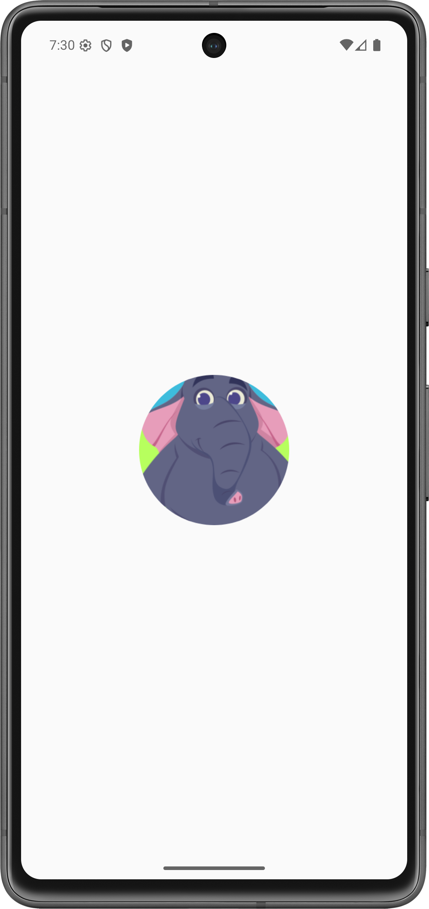
  
  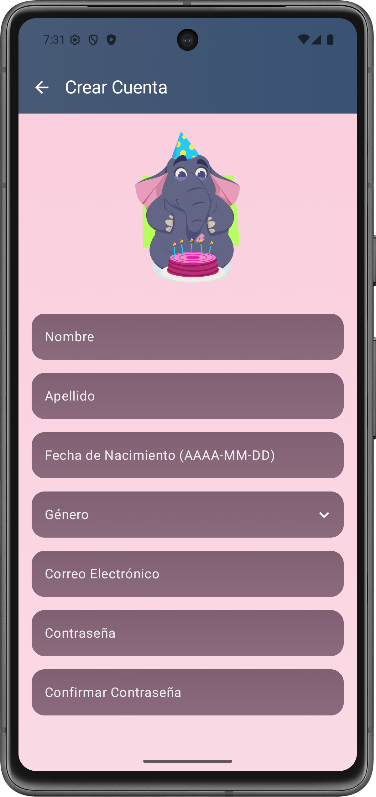
</p>

<p align="center">
  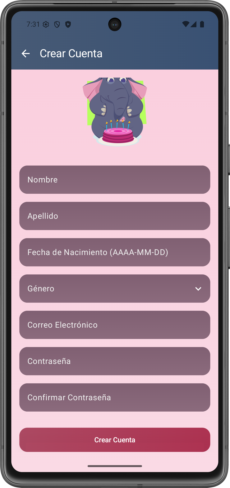
  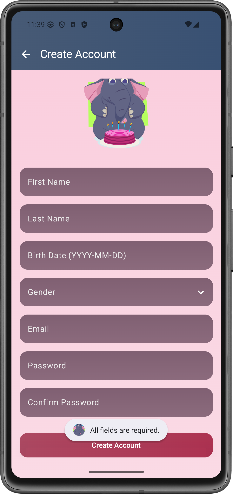
   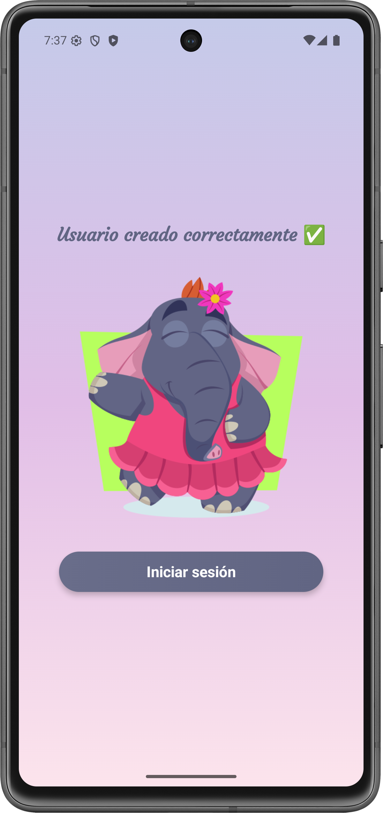
</p>

<p align="center">
  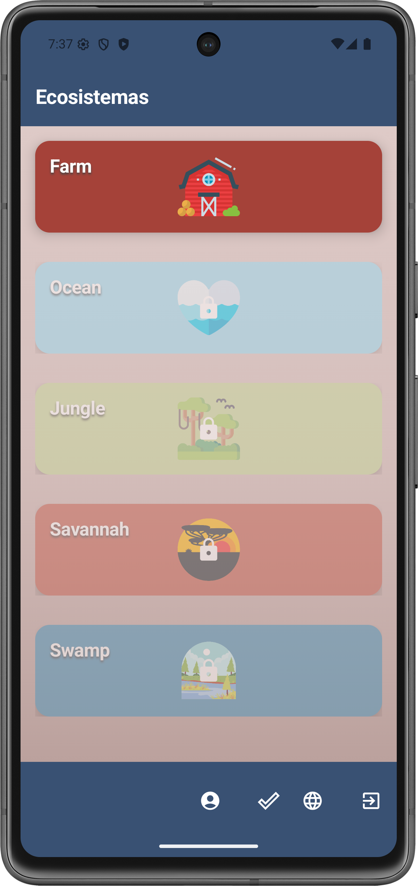
  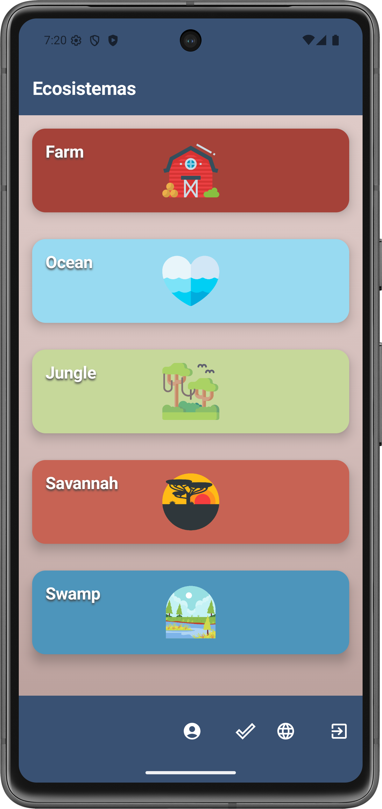
  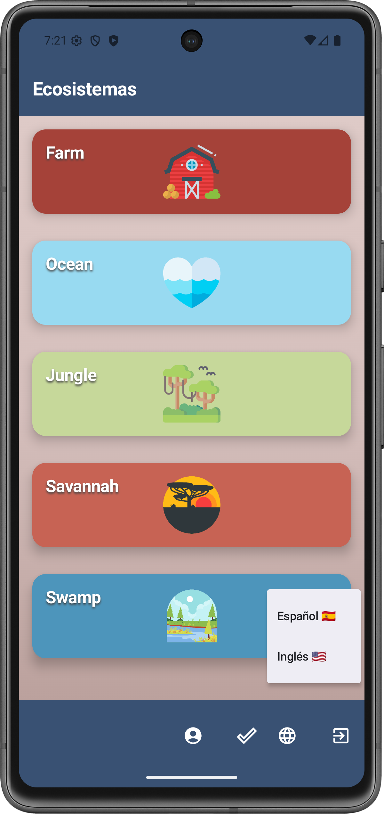
</p>

<p align="center">
  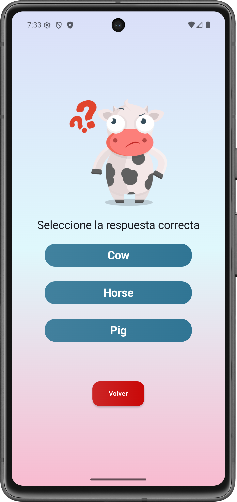
  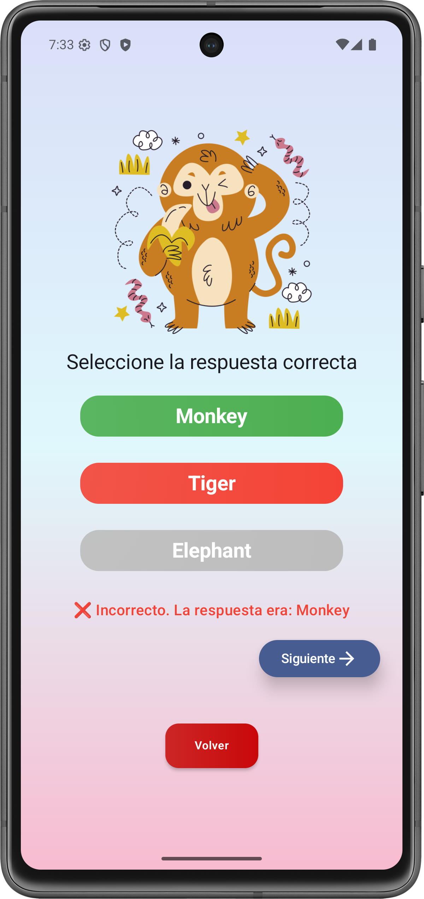
  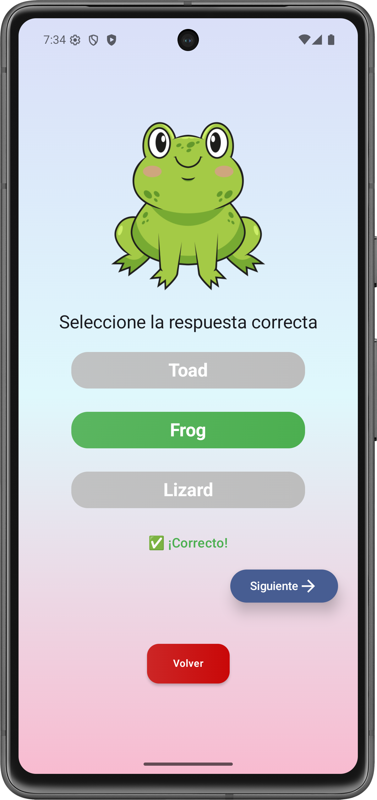
</p>

<p align="center">
  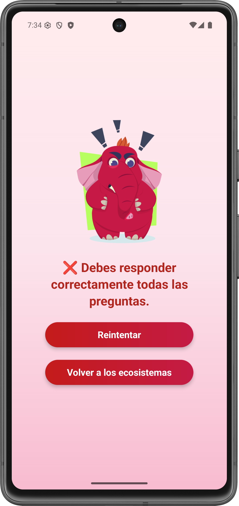
  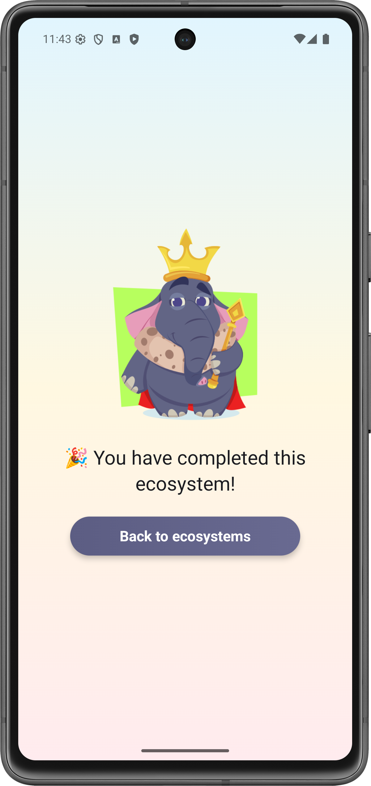
  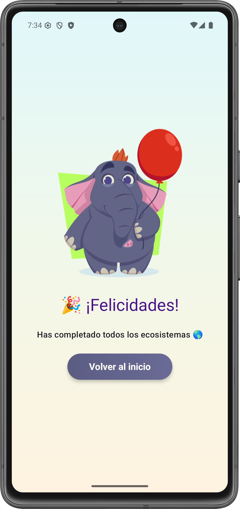
</p>

<p align="center">
  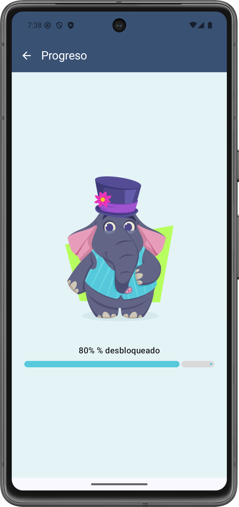
  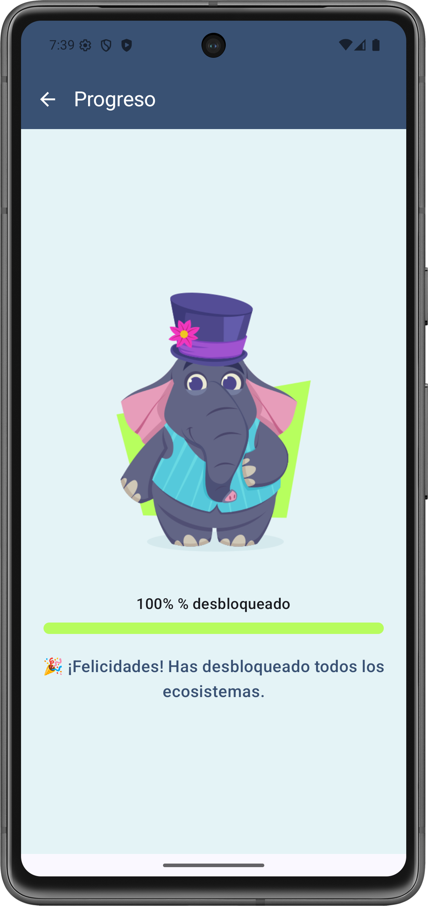
  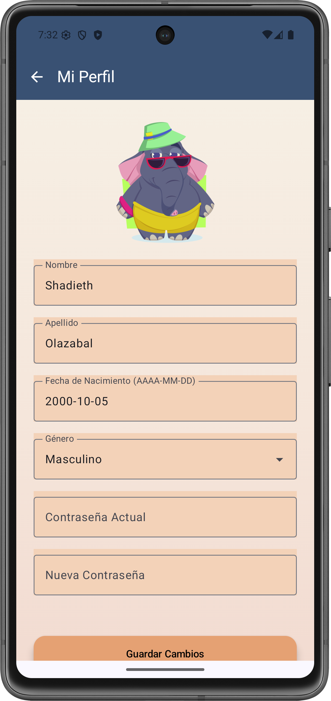
</p>

<p align="center">
  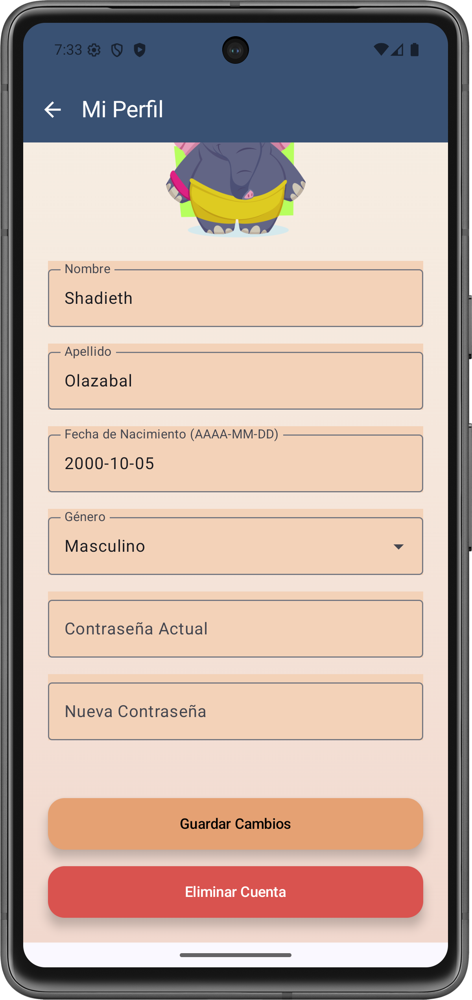
</p>

## Requisitos Previos

- Android Studio Arctic Fox o superior.
- Dispositivo o emulador Android API 26+.
- Conexión activa al backend desplegado.

## Instalación

1. Clona el repositorio:
   ```bash
   git clone https://github.com/usuario/Little-Elephant.git
